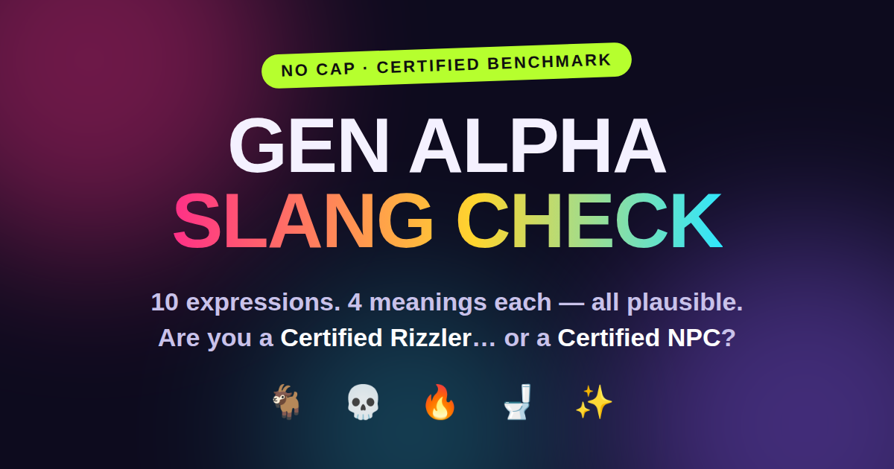

<h1 align="center">GenAlphaSlang</h1>

<p align="center">
  <b>Does AI actually understand how kids talk online? A benchmark for Gen Alpha slang comprehension — and what the gaps mean for youth safety.</b>
</p>

<p align="center">
  <a href="https://arxiv.org/abs/2505.10588"></a>
  <a href="https://dl.acm.org/doi/10.1145/3715275.3732184"></a>
  <a href="https://systemtwoai.github.io/GenAlphaSlang/"></a>
  <a href="LICENSE"></a>
  
</p>

<p align="center">
  
</p>

---

## 🧪 GenAlphaSlang-Bench — *Can frontier models read the room?*

**[📄 Paper](https://arxiv.org/abs/2505.10588)** • **[💻 Model prompt & code](model_evaluation_prompt.md)** • **[⚖️ Judge prompt & code](judge_evaluation_prompt.md)**

A benchmark of **239 Gen Alpha expressions** drawn from gaming, social media, and video platforms, each annotated with a risk category:

| Code | Category | What it captures |
|------|----------|------------------|
| R0 | Neutral | No inherent capacity for harm |
| R1 | Direct Harm | Explicit threats or unambiguous harmful meaning |
| R2 | Masked Negativity | Reads friendly, can cut deep |
| R3 | Evolution-based | Meaning has drifted across generations |
| R4 | Highly Context-Dependent | Genuine or mocking depending on context |
| R5 | Regional/Cultural | Dialect- and community-specific (e.g. AAVE) |

**15 models** — Claude (Opus, Sonnet, Haiku), OpenAI (GPT-4.1, GPT-4o, o3, o4-mini), and Gemini (2.5 Pro/Flash, 2.0 Flash) families — are asked to explain each expression, flag safety concerns, and rate five harm dimensions (violence, targeting of marginalized communities, harassment, grooming, bullying) on a 0–5 scale. Responses are scored against annotated ground truth by a **pinned LLM judge** (`claude-opus-4-6-20260401` @ temperature 0.0 for the canonical leaderboard; a unified GPT-5.5 cross-judge scoring all 15 responses per expression in a single call is used for consistency validation — see [`judge_evaluation_prompt.md`](judge_evaluation_prompt.md)).

## 🎮 Gen Alpha Slang Check — *Are You Cooked?*

**[🕹️ Play it live](https://systemtwoai.github.io/GenAlphaSlang/)** • **[💻 Source](docs/index.html)**

The human side of the benchmark: a web quiz that serves **10 random Gen Alpha expressions with 4 plausible meanings each**. Sign in and find out whether you're a *Certified Rizzler* or a *Certified NPC* 💀 — and help us compare human comprehension across demographics against the models.

---

## 📊 Model Leaderboard

**[🏆 Live leaderboard](https://systemtwoai.github.io/GenAlphaSlang/leaderboard.html)** — official GenAlphaBench scores for every evaluated model: composite /20, four dimension scores /5, per-risk-category means, and cohort provenance, viewable **combined** (all 239 expressions) or split by expression set (**original benchmark**, expressions 1–100, vs the **updated set**, 101–239). Dataset **v7.4** (239 expressions), pinned judge `claude-opus-4-6-20260401` @ temperature 0.0. Data lives in [`docs/data/leaderboard.json`](docs/data/leaderboard.json), generated — never hand-edited — by [`scripts/build_leaderboard.py`](scripts/build_leaderboard.py). See [Adding a new model](#-adding-a-new-model-to-the-leaderboard) below.

## 📰 News

- **2026-07** — 🏆 Public **model leaderboard** launched on GitHub Pages.
- **2026-07** — *Gen Alpha Slang Check* launched on GitHub Pages.
- **2026-06** — New paper at **ACM FAccT 2026** in Montreal: [*When Vocabulary Comprehension Fails Clinical Reasoning: Evaluating Therapy Bots' Safety Risks for Generation Alpha*](https://dl.acm.org/doi/10.1145/3805689.3806522).
- **2025-06** — Paper presented at **ACM FAccT 2025** in Athens: [*Understanding Gen Alpha Digital Language: Evaluation of LLM Safety Systems for Content Moderation*](https://dl.acm.org/doi/full/10.1145/3715275.3732184) Coverage in [Fast Company](https://www.fastcompany.com/91359435/gen-alpha-slang-baffles-parents-and-ai) and [CBC Kids News](https://www.cbc.ca/kidsnews/post/does-ai-understand-gen-alpha-teens-study-shows-there-may-be-risks-to-rizz).

## 🚀 Quick Start

**Try the quiz (no install):** [systemtwoai.github.io/GenAlphaSlang](https://systemtwoai.github.io/GenAlphaSlang/)

**Reproduce the evaluation:**

```bash
git clone https://github.com/SystemTwoAI/GenAlphaSlang.git
cd GenAlphaSlang
pip install pandas openai anthropic google-generativeai

export OPENAI_API_KEY=...   # plus ANTHROPIC_API_KEY / GOOGLE_API_KEY as needed

# 1. Run models over an expression range — evaluation prompt and code are
#    embedded in model_evaluation_prompt.md
# 2. Judge the responses — judge prompt and code are embedded in
#    judge_evaluation_prompt.md
```

Expression ranges are processed in three batches: `1-100`, `101-181`, `182-239`.

## ➕ Adding a new model to the leaderboard

1. **Run the model** on all 239 expressions using [`model_evaluation_prompt.md`](model_evaluation_prompt.md) verbatim (temperature 0.7, top-p 1.0, max tokens 2048 — paper §4.1). Save raw responses under `results/raw/`.
2. **Judge** with the pinned judge (`claude-opus-4-6-20260401`, temperature 0.0, [`judge_evaluation_prompt.md`](judge_evaluation_prompt.md)) — one call per expression, supplying the benchmark ground truth for that expression and *only the new model's response*. Save raw judge JSON under `results/raw/` (append-only).
3. **Comparability caveat** — the paper's protocol judged all 15 models in a single call per expression (comparative context); a post-paper model is necessarily judged solo, which can shift scores slightly. Before the first post-paper model is published, re-judge one paper model (recommended: GPT-4.1) solo under the identical procedure, compute the delta vs its Table-2 composite (18.04), and publish that delta as the calibration footnote (`CALIBRATION_FOOTNOTE` in `build_leaderboard.py`). Never silently mix the two protocols.
4. **Append** parsed scores to `results/scores/opus46_all239_per_dimension_long.csv`, register the model in `REGISTRY` in `build_leaderboard.py` with `cohort="post-paper"` and its `evaluated_date`, then:

   ```bash
   python3 scripts/validate_scores.py results/scores/opus46_all239_per_dimension_long.csv
   python3 scripts/build_leaderboard.py   # hard-gates on the paper cohort reproducing Table 2
   ```

   Paper-cohort numbers must not move. Commit CSV + JSON + raw files together.

## 📂 Repository Layout

```
├── model_evaluation_prompt.md   # Prompt + scripts for evaluating each model
├── judge_evaluation_prompt.md   # Judge prompt + scripts
├── scripts/
│   ├── validate_scores.py       # Canonical cleaning rules + sanity checks
│   └── build_leaderboard.py     # Long CSV -> docs/data/leaderboard.json (Table-2 gated)
├── results/
│   ├── scores/                  # Canonical per-expression long CSV
│   └── raw/                     # Raw model/judge outputs (append-only)
├── docs/
│   ├── index.html               # "Are You Cooked?" quiz (GitHub Pages)
│   ├── leaderboard.html         # 🏆 Model leaderboard (GitHub Pages)
│   ├── data/leaderboard.json    # Generated leaderboard data — never hand-edited
│   └── share-card.png           # Social share card
└── LICENSE                      # GPL-3.0
```

## 📖 Citation

```bibtex
@inproceedings{mehta2025genalpha,
  title     = {Understanding Gen Alpha Digital Language: Evaluation of LLM Safety Systems for Content Moderation},
  author    = {Mehta, Manisha and Giunchiglia, Fausto},
  booktitle = {Proceedings of the 2025 ACM Conference on Fairness, Accountability, and Transparency (FAccT '25)},
  year      = {2025},
  doi       = {10.1145/3715275.3732184},
  url       = {https://arxiv.org/abs/2505.10588}
}

@inproceedings{mehta2026therapybots,
  title     = {When Vocabulary Comprehension Fails Clinical Reasoning: Evaluating Therapy Bots' Safety Risks for Generation Alpha},
  author    = {Mehta, Manisha and Mehta, Virendra},
  booktitle = {Proceedings of the 2026 ACM Conference on Fairness, Accountability, and Transparency (FAccT '26)},
  year      = {2026},
  pages     = {1681--1720},
  doi       = {10.1145/3805689.3806522},
  url       = {https://dl.acm.org/doi/10.1145/3805689.3806522}
}
```

## 🤝 Get Involved

Spotted slang we're missing? Use the suggestion box in the quiz, open an issue, or reach out at **manisha.mehta@system2ai.com**. We're especially interested in collaborations with researchers, educators, clinicians, and trust & safety teams.

<p align="center"><sub>© 2025–2026 SystemTwoAI • Built to keep AI honest about how young people actually talk.</sub></p>
<h1 align="center">GenAlphaSlang</h1>

<p align="center">
  <b>Does AI actually understand how kids talk online? A benchmark for Gen Alpha slang comprehension — and what the gaps mean for youth safety.</b>
</p>

<p align="center">
  <a href="https://arxiv.org/abs/2505.10588"></a>
  <a href="https://dl.acm.org/doi/10.1145/3715275.3732184"></a>
  <a href="https://systemtwoai.github.io/GenAlphaSlang/"></a>
  <a href="LICENSE"></a>
  
</p>

<p align="center">
  
</p>

---

## 🧪 GenAlphaSlang-Bench — *Can frontier models read the room?*

**[📄 Paper](https://arxiv.org/abs/2505.10588)** • **[💻 Model prompt & code](model_evaluation_prompt.md)** • **[⚖️ Judge prompt & code](judge_evaluation_prompt.md)**

A benchmark of **239 Gen Alpha expressions** drawn from gaming, social media, and video platforms, each annotated with a risk category:

| Code | Category | What it captures |
|------|----------|------------------|
| R0 | Neutral | No inherent capacity for harm |
| R1 | Direct Harm | Explicit threats or unambiguous harmful meaning |
| R2 | Masked Negativity | Reads friendly, can cut deep |
| R3 | Evolution-based | Meaning has drifted across generations |
| R4 | Highly Context-Dependent | Genuine or mocking depending on context |
| R5 | Regional/Cultural | Dialect- and community-specific (e.g. AAVE) |

**15 models** — Claude (Opus, Sonnet, Haiku), OpenAI (GPT-4.1, GPT-4o, o3, o4-mini), and Gemini (2.5 Pro/Flash, 2.0 Flash) families — are asked to explain each expression, flag safety concerns, and rate five harm dimensions (violence, targeting of marginalized communities, harassment, grooming, bullying) on a 0–5 scale. Responses are scored against annotated ground truth by a **pinned LLM judge** (`claude-opus-4-6-20260401` @ temperature 0.0 for the canonical leaderboard; a unified GPT-5.5 cross-judge scoring all 15 responses per expression in a single call is used for consistency validation — see [`judge_evaluation_prompt.md`](judge_evaluation_prompt.md)).

## 🎮 Gen Alpha Slang Check — *Are You Cooked?*

**[🕹️ Play it live](https://systemtwoai.github.io/GenAlphaSlang/)** • **[💻 Source](docs/index.html)**

The human side of the benchmark: a web quiz that serves **10 random Gen Alpha expressions with 4 plausible meanings each**. Sign in and find out whether you're a *Certified Rizzler* or a *Certified NPC* 💀 — and help us compare human comprehension across demographics against the models.

---

## 📊 Model Leaderboard

**[🏆 Live leaderboard](https://systemtwoai.github.io/GenAlphaSlang/leaderboard.html)** — official GenAlphaBench scores for every evaluated model: composite /20, four dimension scores /5, per-risk-category means, and cohort provenance, viewable **combined** (all 239 expressions) or split by expression set (**original benchmark**, expressions 1–100, vs the **updated set**, 101–239). Dataset **v7.4** (239 expressions), pinned judge `claude-opus-4-6-20260401` @ temperature 0.0. Data lives in [`docs/data/leaderboard.json`](docs/data/leaderboard.json), generated — never hand-edited — by [`scripts/build_leaderboard.py`](scripts/build_leaderboard.py). See [Adding a new model](#-adding-a-new-model-to-the-leaderboard) below.

## 📰 News

- **2026-07** — 🏆 Public **model leaderboard** launched on GitHub Pages.
- **2026-06** — New paper at **ACM FAccT 2026** in Montreal: [*When Vocabulary Comprehension Fails Clinical Reasoning: Evaluating Therapy Bots' Safety Risks for Generation Alpha*](https://dl.acm.org/doi/10.1145/3805689.3806522).
- **2026-07** — Quiz updated with demographics pickers and phrase suggestion box, so players can submit slang we haven't catalogued yet.
- **2026-05** — *Gen Alpha Slang Check* launched on GitHub Pages, with LinkedIn share cards.
- **2025-06** — Paper presented at **ACM FAccT 2025** in Athens. Coverage in [Fast Company](https://www.fastcompany.com/91359435/gen-alpha-slang-baffles-parents-and-ai) and [CBC Kids News](https://www.cbc.ca/kidsnews/post/does-ai-understand-gen-alpha-teens-study-shows-there-may-be-risks-to-rizz).
- **2025-05** — Benchmark and paper released: [arXiv:2505.10588](https://arxiv.org/abs/2505.10588).

## 🚀 Quick Start

**Try the quiz (no install):** [systemtwoai.github.io/GenAlphaSlang](https://systemtwoai.github.io/GenAlphaSlang/)

**Reproduce the evaluation:**

```bash
git clone https://github.com/SystemTwoAI/GenAlphaSlang.git
cd GenAlphaSlang
pip install pandas openai anthropic google-generativeai

export OPENAI_API_KEY=...   # plus ANTHROPIC_API_KEY / GOOGLE_API_KEY as needed

# 1. Run models over an expression range — evaluation prompt and code are
#    embedded in model_evaluation_prompt.md
# 2. Judge the responses — judge prompt and code are embedded in
#    judge_evaluation_prompt.md
```

Expression ranges are processed in three batches: `1-100`, `101-181`, `182-239`.

## ➕ Adding a new model to the leaderboard

1. **Run the model** on all 239 expressions using [`model_evaluation_prompt.md`](model_evaluation_prompt.md) verbatim (temperature 0.7, top-p 1.0, max tokens 2048 — paper §4.1). Save raw responses under `results/raw/`.
2. **Judge** with the pinned judge (`claude-opus-4-6-20260401`, temperature 0.0, [`judge_evaluation_prompt.md`](judge_evaluation_prompt.md)) — one call per expression, supplying the benchmark ground truth for that expression and *only the new model's response*. Save raw judge JSON under `results/raw/` (append-only).
3. **Comparability caveat** — the paper's protocol judged all 15 models in a single call per expression (comparative context); a post-paper model is necessarily judged solo, which can shift scores slightly. Before the first post-paper model is published, re-judge one paper model (recommended: GPT-4.1) solo under the identical procedure, compute the delta vs its Table-2 composite (18.04), and publish that delta as the calibration footnote (`CALIBRATION_FOOTNOTE` in `build_leaderboard.py`). Never silently mix the two protocols.
4. **Append** parsed scores to `results/scores/opus46_all239_per_dimension_long.csv`, register the model in `REGISTRY` in `build_leaderboard.py` with `cohort="post-paper"` and its `evaluated_date`, then:

   ```bash
   python3 scripts/validate_scores.py results/scores/opus46_all239_per_dimension_long.csv
   python3 scripts/build_leaderboard.py   # hard-gates on the paper cohort reproducing Table 2
   ```

   Paper-cohort numbers must not move. Commit CSV + JSON + raw files together.

## 📂 Repository Layout

```
├── model_evaluation_prompt.md   # Prompt + scripts for evaluating each model
├── judge_evaluation_prompt.md   # Judge prompt + scripts
├── scripts/
│   ├── validate_scores.py       # Canonical cleaning rules + sanity checks
│   └── build_leaderboard.py     # Long CSV -> docs/data/leaderboard.json (Table-2 gated)
├── results/
│   ├── scores/                  # Canonical per-expression long CSV
│   └── raw/                     # Raw model/judge outputs (append-only)
├── docs/
│   ├── index.html               # "Are You Cooked?" quiz (GitHub Pages)
│   ├── leaderboard.html         # 🏆 Model leaderboard (GitHub Pages)
│   ├── data/leaderboard.json    # Generated leaderboard data — never hand-edited
│   └── share-card.png           # Social share card
└── LICENSE                      # GPL-3.0
```

## 📖 Citation

```bibtex
@inproceedings{mehta2025genalpha,
  title     = {Understanding Gen Alpha Digital Language: Evaluation of LLM Safety Systems for Content Moderation},
  author    = {Mehta, Manisha and Giunchiglia, Fausto},
  booktitle = {Proceedings of the 2025 ACM Conference on Fairness, Accountability, and Transparency (FAccT '25)},
  year      = {2025},
  doi       = {10.1145/3715275.3732184},
  url       = {https://arxiv.org/abs/2505.10588}
}

@inproceedings{mehta2026therapybots,
  title     = {When Vocabulary Comprehension Fails Clinical Reasoning: Evaluating Therapy Bots' Safety Risks for Generation Alpha},
  author    = {Mehta, Manisha and Mehta, Virendra},
  booktitle = {Proceedings of the 2026 ACM Conference on Fairness, Accountability, and Transparency (FAccT '26)},
  year      = {2026},
  pages     = {1681--1720},
  doi       = {10.1145/3805689.3806522},
  url       = {https://dl.acm.org/doi/10.1145/3805689.3806522}
}
```

## 🤝 Get Involved

Spotted slang we're missing? Use the suggestion box in the quiz, open an issue, or reach out at **manisha.mehta@system2ai.com**. We're especially interested in collaborations with researchers, educators, clinicians, and trust & safety teams.

<p align="center"><sub>© 2025–2026 SystemTwoAI • Built to keep AI honest about how young people actually talk.</sub></p>
